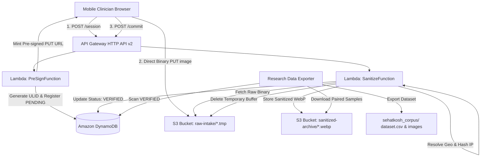

# SehatKosh Donor Web: Comprehensive System Architecture & Engineering Documentation

> **Project Name**: SehatKosh Donor Web  
> **Repository**: `https://github.com/AHSANooo/SehatKosh-Donor-Web.git`  
> **AWS Stack**: `sehatkosh-donor-backend` (Region: `ap-south-1` / Mumbai)  
> **Primary Purpose**: Zero-cost, high-resilience, privacy-first web application designed for mobile clinicians to contribute handwritten/printed prescription scans and transcriptions to the SehatKosh Urdu/Pakistani healthcare AI research corpus.

---

## Table of Contents
1. [System Overview & Architectural Principles](#1-system-overview--architectural-principles)
2. [Frontend Application Architecture](#2-frontend-application-architecture)
   - [UI/UX Design & Aesthetic Refinements](#uiux-design--aesthetic-refinements)
   - [Zero-Data-Loss Offline Engine (IndexedDB)](#zero-data-loss-offline-engine-indexeddb)
   - [Client-Side PII Shield](#client-side-pii-shield)
   - [Local Mock Development Server](#local-mock-development-server)
3. [AWS Serverless Infrastructure & Backend Services](#3-aws-serverless-infrastructure--backend-services)
   - [AWS SAM Architecture (`template.yaml`)](#aws-sam-architecture-templateyaml)
   - [Pre-Sign Service (`services/pre_sign.py`)](#pre-sign-service-servicespre_signpy)
   - [Sanitization & Commit Service (`services/sanitize.py`)](#sanitization--commit-service-servicessanitizepy)
   - [Amazon S3 Storage Architecture & Lifecycle Rules](#amazon-s3-storage-architecture--lifecycle-rules)
   - [Amazon DynamoDB Schema & Ledger](#amazon-dynamodb-schema--ledger)
4. [WSL2 & Docker Containerization Workflow](#4-wsl2--docker-containerization-workflow)
   - [Why Docker Desktop Was Omitted (RAM Optimization)](#why-docker-desktop-was-omitted-ram-optimization)
   - [Native C-Extensions & The Linux Compilation Challenge (Pillow)](#native-c-extensions--the-linux-compilation-challenge-pillow)
   - [Architecture Realignment: ARM64 vs x86_64](#architecture-realignment-arm64-vs-x86_64)
   - [Container Build & SAM Deployment Process](#container-build--sam-deployment-process)
5. [Geolocation Resolution & Privacy-Preserving Telemetry](#5-geolocation-resolution--privacy-preserving-telemetry)
   - [Edge Header Extraction (CloudFront & Cloudflare)](#edge-header-extraction-cloudfront--cloudflare)
   - [Direct Request Fallback (IP-API)](#direct-request-fallback-ip-api)
   - [Zero Raw-IP Retention (SHA-256 Fingerprinting)](#zero-raw-ip-retention-sha-256-fingerprinting)
6. [Multimodal Dataset Corpus Exporter (`scripts/export_corpus.py`)](#6-multimodal-dataset-corpus-exporter-scriptsexport_corpuspy)
   - [Export Workflow & Structure](#export-workflow--structure)
   - [Generated Artifacts (`dataset.csv`, `dataset.json`, `.webp`, `.txt`)](#generated-artifacts-datasetcsv-datasetjson-webp-txt)
7. [Automated Testing & Quality Assurance](#7-automated-testing--quality-assurance)
   - [Frontend Vitest Suite](#frontend-vitest-suite)
   - [Backend Python Unit Tests](#backend-python-unit-tests)
   - [Live Production Smoke Tests](#live-production-smoke-tests)
8. [Complete CLI Command Reference](#8-complete-cli-command-reference)

---

## 1. System Overview & Architectural Principles

The SehatKosh Donor Web application was engineered under strict research and production guidelines:

1. **Zero AWS Cost Guarantee (100% Free Tier Compliant)**:
   - Employs Amazon API Gateway HTTP API v2 (1,000,000 free requests/month).
   - Serverless AWS Lambda compute (1,000,000 requests/month, 3.2M seconds compute).
   - DynamoDB On-Demand billing (25 GB free storage, 25 read/write units).
   - Amazon S3 Standard (5 GB free storage, 20,000 GETs, 2,000 PUTs).
2. **Zero PII Exposure (Strict Medical Ethics & HIPAA/GDPR Alignment)**:
   - Scrubbing Pakistani CNIC (National ID), mobile phone numbers, and clinician/patient names both at client runtime and verified on the server.
   - Raw IP addresses are **never persisted** to storage or databases; only an irrecoverable 16-character SHA-256 hash is retained for abuse prevention.
   - Raw uploaded images are strictly buffered in a temporary quarantine prefix (`raw-intake/`) and automatically purged after 24 hours. Sanitized versions are stripped of all EXIF/GPS metadata and re-encoded to WebP.
3. **Resilience in Unstable Rural Networks**:
   - Rural clinics often face cellular dropouts. Contributions are buffered in client-side IndexedDB with exponential backoff synchronization.



---

## 2. Frontend Application Architecture

### UI/UX Design & Aesthetic Refinements
The user interface was purposefully designed to look like a clean, modern clinical tool:
* **Color Palette & Light Theme**: Built using clean medical slate tones (`bg-slate-50`, `bg-white`, slate borders `#E2E8F0`, and medical teal accents `#0D9488`). Avoided aggressive dark themes to ensure readability in bright clinical environments.
* **Centered Elevation Card**: All interactions are housed in a centered card (`max-w-xl`, `rounded-2xl`, subtle multi-layer box shadows) providing clear visual hierarchy.
* **Streamlined Header**:
  - Removed decorative icons (such as the `+` box icon) to maximize screen real estate.
  - The `Queue` status pill is dynamically hidden when the offline queue is empty (0 pending items), reducing visual noise and perceived latency.
* **Upload Button Dynamic Feedback**:
  - The submit button is strictly labeled `"Upload"` when requirements are satisfied.
  - If the transcription character requirement (< 10 characters) is not met, the button dynamically indicates the deficit: `Upload (need X more)`.
* **Clean Confirmation Dialog**:
  - Removed technical internal identifiers (`01JC...` ULIDs) and the unnecessary "Copy Receipt ID" button.
  - Presents a clean, welcoming confirmation showing an archived status badge and a direct action to donate another prescription.
* **Mobile-First Touch Ergonomics**:
  - 48px minimum touch targets.
  - Safe-area inset handling (`min-h-[100dvh]`).
  - Mobile camera direct trigger via `<input type="file" accept="image/*" capture="environment">`.

### Zero-Data-Loss Offline Engine (IndexedDB)
Located in [src/main.ts](file:///d:/FYP/Donation/src/main.ts):
* Utilizes `idb-keyval` for persistent browser storage.
* If a network error, HTTP 5xx, or socket disconnect occurs during upload, the contribution (image blob + transcription + timestamp) is committed to IndexedDB under the `sehatkosh_offline_queue` store.
* When the browser fires the `window.addEventListener('online')` event or the user submits new records, a background synchronization worker processes the queue with exponential backoff.

### Client-Side PII Shield
Located in [src/piiShield.ts](file:///d:/FYP/Donation/src/piiShield.ts) and tested via [tests/piiShield.test.ts](file:///d:/FYP/Donation/tests/piiShield.test.ts):
* Real-time regex scanner that warns the clinician before transmission if sensitive patterns are detected:
  - **Pakistani CNIC**: `\b\d{5}[-]?\d{7}[-]?\d{1}\b`
  - **Pakistani Phone Numbers**: `(\+92|0)?3\d{2}[-\s]?\d{7}\b`
  - **Clinician/Patient Names**: `(?i)\b(dr|doctor|patient|mr|mrs|ms)\.?\s+[a-zA-Z]+`

### Local Mock Development Server
Configured inside [vite.config.ts](file:///d:/FYP/Donation/vite.config.ts):
* Intercepts `POST /session`, `PUT /mock-s3-upload/*`, and `POST /commit`.
* Allows full end-to-end development, image selection, offline queuing, and upload testing on `localhost:5173` without requiring AWS credentials or an internet connection.

---

## 3. AWS Serverless Infrastructure & Backend Services

### AWS SAM Architecture (`template.yaml`)
Defined in [template.yaml](file:///d:/FYP/Donation/template.yaml):
* **CloudFormation Stack Name**: `sehatkosh-donor-backend`
* **Region**: `ap-south-1` (Mumbai)
* **HttpApi (`AWS::Serverless::HttpApi`)**:
  - Route 1: `POST /session` -> `PreSignFunction`
  - Route 2: `POST /commit` -> `SanitizeFunction`
  - CORS enabled with `AllowOrigins: ['*']`, `AllowMethods: ['POST', 'OPTIONS']`, and header forwarding.
* **Lambdas**:
  - Runtime: Python 3.11
  - Architecture: `x86_64`
  - Memory: 256 MB
  - Timeout: 10 seconds

### Pre-Sign Service (`services/pre_sign.py`)
1. **Input Payload**: `{"mime_type": "image/jpeg", "file_size": 204800}`.
2. **Validation**:
   - MIME Whitelist: `image/jpeg`, `image/png`, `image/webp`.
   - Max file size: 10 MB (10,485,760 bytes).
3. **Identifier Minting**: Generates a monotonically sortable 26-character ULID (e.g. `01M2N82S23S7FG1ZQTQHE26W70`).
4. **DynamoDB Record Initialization**:
   - Partition Key: `DONATION#<ulid>`
   - Status: `PENDING`
   - Created At: UTC UNIX timestamp.
5. **S3 Pre-Signed URL Generation**:
   - Issues an S3 PUT URL for `raw-intake/<ulid>.tmp` with a 300-second expiration.

### Sanitization & Commit Service (`services/sanitize.py`)
1. **Input Payload**: `{"donation_id": "<ulid>", "transcription": "<raw clinical text>"}`.
2. **Raw Binary Intake & Verification**:
   - Reads `raw-intake/<donation_id>.tmp` directly from S3.
   - Inspects file magic bytes:
     - JPEG: `\xFF\xD8\xFF`
     - PNG: `\x89\x50\x4E\x47`
     - WebP: `RIFF....WEBP`
   - Rejects non-matching or executable payloads, setting DynamoDB status to `QUARANTINED`.
3. **Image Normalization & EXIF Purge**:
   - Utilizes `PIL.ImageOps.exif_transpose()` to respect phone camera orientation while stripping all EXIF metadata (GPS coordinates, camera serial numbers, timestamps).
   - Converts color space to RGB/RGBA.
   - Re-encodes the image to high-efficiency WebP format (`quality=85, method=6`).
4. **PII Scrubbing**:
   - Sanitizes CNICs (`[REDACTED_CNIC]`), phone numbers (`[REDACTED_PHONE]`), and names (`[REDACTED_NAME]`).
   - Encapsulates clean text in `<donor_transcription>` delimiters.
5. **Geolocation & IP Telemetry**:
   - Resolves country and city (see Section 5).
   - Hashes IP to a 16-character SHA-256 fingerprint.
6. **Archive & Commit**:
   - Writes sanitized image to: `sanitized-archive/YYYY/MM/<donation_id>.webp`.
   - Deletes temporary raw object: `raw-intake/<donation_id>.tmp`.
   - Updates DynamoDB record status to `VERIFIED`.

### Amazon S3 Storage Architecture & Lifecycle Rules
Bucket: `sehatkosh-donor-storage-847333136820`
* **Security**:
  - `BlockPublicAcls: true`
  - `BlockPublicPolicy: true`
  - `IgnorePublicAcls: true`
  - `RestrictPublicBuckets: true`
  - Server-Side Encryption: AES-256 (`SSEAlgorithm: AES256`).
* **Lifecycle Rules**:
  - Prefix `raw-intake/`: Automatically expires and purges uncommitted uploads after **1 day** (`ExpirationInDays: 1`), ensuring orphaned uploads never incur storage costs.

### Amazon DynamoDB Schema & Ledger
Table: `sehatkosh-donations`
* **Billing Mode**: `PAY_PER_REQUEST` (On-demand)
* **Primary Key**: `PK` (String) -> `DONATION#<ulid>`
* **Attributes**:
  - `status`: `PENDING` | `VERIFIED` | `QUARANTINED`
  - `transcription`: Sanitized text wrapped in `<donor_transcription>`
  - `char_count`: Length of clean transcription
  - `s3_sanitized_key`: Permanent S3 object path (`sanitized-archive/2026/09/...webp`)
  - `geo_country`: Resolved donor country (e.g. `Pakistan`)
  - `geo_city`: Resolved donor city (e.g. `Sargodha`)
  - `ip_fingerprint`: 16-char SHA-256 hash of donor IP
  - `image_dimensions`: Image resolution (e.g. `1200x1600`)
  - `file_size`: Final WebP file size in bytes
  - `verified_at`: UNIX timestamp of commit

---

## 4. WSL2 & Docker Containerization Workflow

### Why Docker Desktop Was Omitted (RAM Optimization)
* **User Constraint**: Docker Desktop on Windows consumes significant background RAM (typically 2-4 GB idle via `vmmem`).
* **Architectural Solution**: Docker Engine was installed natively inside **WSL2** (Ubuntu distribution) without Docker Desktop.
* AWS SAM CLI inside WSL2 connects to the local Linux Docker daemon at `/var/run/docker.sock`.

### Native C-Extensions & The Linux Compilation Challenge (Pillow)
* **The Problem**:
  `Pillow` (the Python Imaging Library) contains compiled C-libraries (`_imaging.so`). When building Python packages on Windows, standard `pip install` bundles Windows `.pyd` dynamic libraries (`_imaging.cp311-win_amd64.pyd`). When deployed to AWS Lambda (which runs Amazon Linux), Lambda throws:
  `Runtime.ImportModuleError: cannot import name '_imaging' from 'PIL'`.
* **The Solution**:
  We execute `sam build --use-container`.
  This mounts the `/services` folder into Amazon's official Lambda build container:
  `public.ecr.aws/sam/build-python3.11:latest-x86_64`.
  Dependencies are compiled directly against Amazon Linux C-libraries.
* **Wheel Pinning Fix**:
  Unpinned `Pillow>=10.0.0` caused pip inside the container to attempt building from source. We pinned `requirements.txt` to:
  ```text
  Pillow==10.4.0
  boto3>=1.34.0
  ulid-py>=1.1.0
  ```
  This allowed pip to fetch the pre-compiled `manylinux_2_17_x86_64` binary wheel instantly.

### Architecture Realignment: ARM64 vs x86_64
* Initially, the project was targeted for AWS Graviton2 (`arm64`).
* However, the developer's Windows/WSL2 host is an `x86_64` machine. When SAM CLI attempted to build ARM64 containers under WSL2 Docker, QEMU emulation failed with:
  `exec /bin/sh: exec format error`.
* **Resolution**: Updated `Architectures: [x86_64]` in [template.yaml](file:///d:/FYP/Donation/template.yaml).
  * AWS Free Tier allowances (1,000,000 requests, 3.2M seconds) are identical across both architectures.
  * Container compilation executed natively on `x86_64` hardware without emulation overhead.

### Container Build & SAM Deployment Process
All backend builds and deployments are executed directly inside WSL2 with zero Windows toolchain dependencies:
```bash
wsl -e sh -c "cd /mnt/d/FYP/Donation && SAM_CLI_TELEMETRY=0 sam build --use-container && SAM_CLI_TELEMETRY=0 sam deploy --no-confirm-changeset"
```

---

## 5. Geolocation Resolution & Privacy-Preserving Telemetry

To analyze regional linguistic and prescribing patterns without violating medical confidentiality or privacy laws (HIPAA/GDPR), `resolve_geo_location()` in [services/sanitize.py](file:///d:/FYP/Donation/services/sanitize.py) implements a multi-tier resolution strategy:

### Edge Header Extraction (CloudFront & Cloudflare)
When requests route through modern edge CDNs, regional headers are injected automatically:
* **Amazon CloudFront**:
  - `cloudfront-viewer-country-name` (e.g. `Pakistan`)
  - `cloudfront-viewer-country` (e.g. `PK`)
  - `cloudfront-viewer-city-name` (e.g. `Lahore`, `Sargodha`)
* **Cloudflare Pages / Proxies**:
  - `cf-ipcountry`
  - `cf-ipcity`

### Direct Request Fallback (IP-API)
When clients access API Gateway directly (such as during direct mobile API usage or development):
* The Lambda extracts the client's public IP from `x-forwarded-for` or `requestContext.http.sourceIp`.
* If edge headers are absent, a safe fallback query is made to `http://ip-api.com/json/{raw_ip}?fields=status,country,countryCode,city`.
* **Guardrails**:
  - Private IP ranges (`127.*`, `10.*`, `192.168.*`, `localhost`) are excluded.
  - Strict 1.5-second network timeout.
  - Wrapped in a `try/except` block to ensure that lookup failures **never block or fail** the donation commit.

### Zero Raw-IP Retention (SHA-256 Fingerprinting)
* The client's raw IP address is **never stored** in S3 or DynamoDB.
* It is immediately transformed via:
  ```python
  ip_hash = hashlib.sha256(raw_ip.encode()).hexdigest()[:16]
  ```
* This creates a permanent, one-way pseudonym:
  - Prevents tracking the donor's physical network.
  - Allows researchers to identify duplicate submissions from the same terminal.

---

## 6. Multimodal Dataset Corpus Exporter (`scripts/export_corpus.py`)

To prepare the dataset for AI/ML training (e.g. TrOCR, Donut, LayoutLM, or custom Vision-Language Models), [scripts/export_corpus.py](file:///d:/FYP/Donation/scripts/export_corpus.py) extracts all verified contributions into a clean, multimodal directory structure.

### Export Workflow & Structure
Run on any machine with configured AWS credentials:
```bash
python scripts/export_corpus.py
```
Output folder: `sehatkosh_corpus/`
```text
sehatkosh_corpus/
├── dataset.csv                  # Tabular master index
├── dataset.json                 # Machine-readable JSON index
├── images/                      # High-quality sanitized WebP images
│   ├── 01M2N18Z30GZK4SKF6YR17Q609.webp
│   ├── 01M2N82S23S7FG1ZQTQHE26W70.webp
│   └── 01M2N6K1ZKPAMWYX2DM5059NHP.webp
└── transcriptions/              # Paired clean transcription text files
    ├── 01M2N18Z30GZK4SKF6YR17Q609.txt
    ├── 01M2N82S23S7FG1ZQTQHE26W70.txt
    └── 01M2N6K1ZKPAMWYX2DM5059NHP.txt
```

### Generated Catalog Sample (`dataset.csv`)

| donation_id | status | image_file | transcription_clean | char_count | image_dimensions | file_size_bytes | geo_country | geo_city | verified_at |
| :--- | :--- | :--- | :--- | :--- | :--- | :--- | :--- | :--- | :--- |
| `01M2N82S23S7FG1ZQTQHE26W70` | `VERIFIED` | `images/01M2N82S...webp` | `Live Geo Test: [REDACTED_NAME] prescribed Amoxicillin 500mg by [REDACTED_NAME]` | 93 | 100x100 | 98 | **Pakistan** | **Sargodha** | 1789567005 |

---

## 7. Automated Testing & Quality Assurance

The codebase includes three tiers of test suites:

### 1. Frontend Vitest Suite
* File: [tests/piiShield.test.ts](file:///d:/FYP/Donation/tests/piiShield.test.ts)
* Verifies client-side regex detection of Pakistani CNICs, phone numbers, and clinician names.
* Command:
  ```bash
  npm test
  ```
  *Output: 5 tests passed (100% green).*

### 2. Backend Python Unit Tests
* File: [tests/test_lambda_services.py](file:///d:/FYP/Donation/tests/test_lambda_services.py)
* Verifies:
  - MIME whitelist (`image/jpeg`, `image/png`, `image/webp` allowed; `pdf`, `sh` rejected).
  - Magic byte binary inspection.
  - Server-side PII scrubbing regex & delimiter wrapping.
  - Edge header geolocation extraction (CloudFront & Cloudflare).
* Command:
  ```bash
  python -m unittest tests/test_lambda_services.py
  ```
  *Output: 4 tests passed in 0.001s (100% green).*

### 3. Live Production Smoke Tests
* File: [tests/test_live_geo.py](file:///d:/FYP/Donation/tests/test_live_geo.py)
* Dispatches a real test transaction against the live AWS infrastructure:
  1. Requests upload session via `POST /session`.
  2. Uploads binary JPEG directly to S3 via pre-signed URL.
  3. Dispatches `POST /commit`.
  4. Queries DynamoDB item and verifies that `geo_country: Pakistan`, `geo_city: Sargodha`, and `ip_fingerprint` are stored accurately.
* Command:
  ```bash
  python tests/test_live_geo.py
  ```

---

## 8. Complete CLI Command Reference

### Local Development & Testing
```bash
# Install frontend dependencies
npm install

# Run frontend with local mock API (http://localhost:5173)
npm run dev

# Run frontend tests
npm test

# Run backend unit tests
python -m unittest tests/test_lambda_services.py

# Build frontend production bundle
npm run build
```

### Backend Build & AWS Deployment (via WSL2)
```bash
# Build Lambda artifacts inside Linux x86_64 container
wsl -e sh -c "cd /mnt/d/FYP/Donation && SAM_CLI_TELEMETRY=0 sam build --use-container"

# Deploy to AWS CloudFormation
wsl -e sh -c "cd /mnt/d/FYP/Donation && SAM_CLI_TELEMETRY=0 sam deploy --no-confirm-changeset"

# Single-command build and deploy
wsl -e sh -c "cd /mnt/d/FYP/Donation && SAM_CLI_TELEMETRY=0 sam build --use-container && SAM_CLI_TELEMETRY=0 sam deploy --no-confirm-changeset"
```

### Dataset Retrieval
```bash
# Export all verified records from AWS to local folder
python scripts/export_corpus.py

# Run live end-to-end integration test
python tests/test_live_geo.py
```

### Git Workflow & Synchronizing Branches
```bash
# Commit changes on dev branch
git checkout dev
git add .
git commit -m "feat: description of changes"
git push origin dev

# Merge dev into main and push
git checkout main
git merge dev
git push origin main
git checkout dev
```
